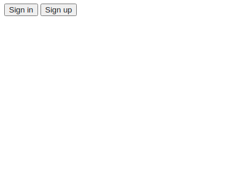
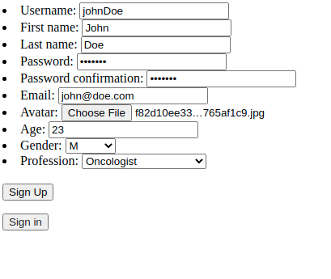
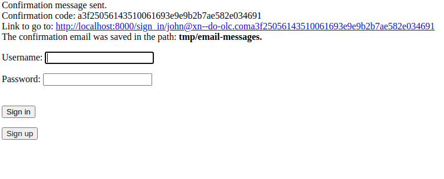
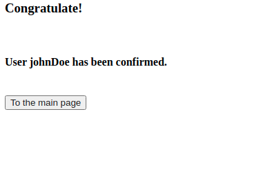
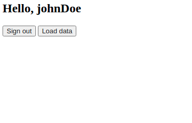
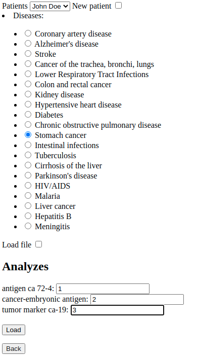
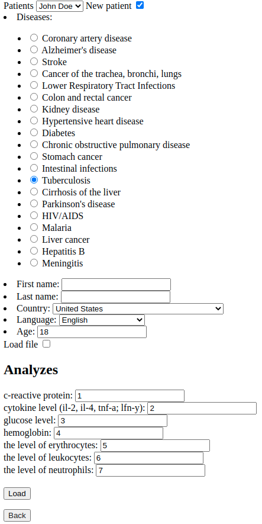
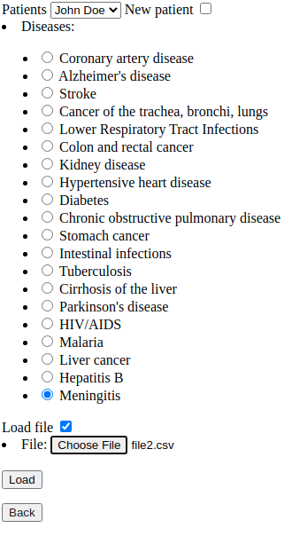
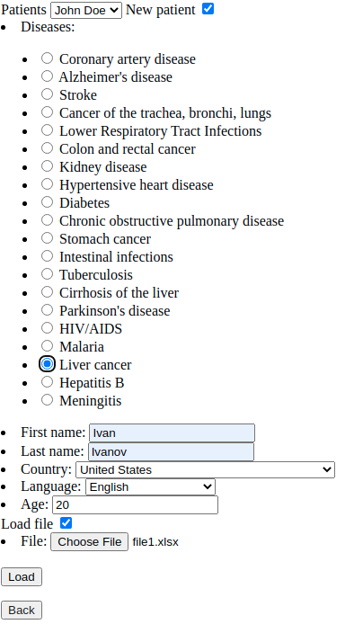

#Instruction
2 applications have been created in the project:
- authapp
- mainapp

The authapp application is configured to register a user (doctor) by sending an email confirming registration, as well as logging in.

To register, click **sign up**.

Fill out the registration form and click **Sign Up**.

Go to the registration confirmation page. 
To simplify, the confirmation link is placed on the page, 
and the contents of the letter in text file format are stored 
in the tmp/email-messages directory.
Click on the **link**.

We find ourselves on a page with a message about the successful 
completion of registration.  Click **To the main page**.

In the next window, we can choose to log out or go to 
the patient data download page. Click **Load data**.

We find ourselves on the mainapp application page to download patient data.
The project implements 4 data loading scenarios:

- the patient is already in the database, loading data through the form fields;
- the patient is new, loading data through the form fields;
- the patient is already in the database, uploading data via a file;
- the patient is new, uploading data via a file.

***

####The patient is already in the database, loading data through the form fields.

Select the patient from the drop-down list, select the disease, 
the fields required for testing will be loaded automatically. 
Fill in the fields, click **Load**.

***

####The patient is new, loading data through the form fields.

Click the **New patient** checkbox, fill in the patient data, 
select the disease, the fields required for testing will be 
loaded automatically. Fill in the fields, click **Load**.

***

####The patient is already in the database, uploading data via a file.

Select the patient from the drop-down list, select the disease,
click on the **Load file** checkbox, and the fields for entering test 
results will disappear, upload a file with the test results,
click **Load**.

***

####The patient is new, uploading data via a file.

Select the patient from the drop-down list, select the disease, 
fill in the patient data, upload a file with the test results,
click **Load**.

